# Laporan Proyek Machine Learning - Riyan Zaenal Arifin

## Domain Proyek

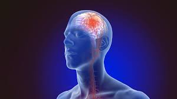

Stroke adalah penyebab utama kedua dari kematian dan salah satu faktor utama yang menyebabkan kecacatan di dunia [[1]](https://jurnal-d3per.uwhs.ac.id/index.php/mak/article/view/179). Kondisi ini terjadi akibat gangguan pada sistem pembuluh darah otak, yang menghambat aliran darah serta oksigen ke otak, sehingga mengakibatkan kerusakan atau bahkan kematian jaringan otak [[2]](https://fmj.fk.umi.ac.id/index.php/fmj/article/view/468/313). Faktor risiko seperti bertambahnya usia, gaya hidup tidak sehat (misalnya kebiasaan merokok, konsumsi alkohol, dan makanan cepat saji), stres kronis, kerja berlebihan, serta kurangnya olahraga, turut berkontribusi pada meningkatnya prevalensi stroke [[2]](https://fmj.fk.umi.ac.id/index.php/fmj/article/view/468/313).

Pendekatan tradisional dalam mendeteksi risiko stroke biasanya membutuhkan waktu lama karena bergantung pada analisis klinis dan pemeriksaan laboratorium. Di sisi lain, teknologi machine learning menawarkan solusi yang lebih cepat dan akurat dengan menganalisis data medis secara efisien, termasuk integrasi faktor klinis, riwayat kesehatan, dan gaya hidup [[3]](https://digilib.uns.ac.id/dokumen/detail/121770/). Pendekatan ini memungkinkan prediksi risiko stroke yang lebih presisi, mendukung tenaga medis untuk melakukan intervensi preventif yang tepat waktu.

Referensi:

[[1] Penerapan Range Of Motion pada pasien stroke dengan gangguan mobilitas fisik](https://jurnal-d3per.uwhs.ac.id/index.php/mak/article/view/179)

[[2] Karakteristik Penderita Stroke Iskemik dan Stroke Hemoragik](https://fmj.fk.umi.ac.id/index.php/fmj/article/view/468/313)

[[3] KOMPARASI METODE KLASIFIKASI MACHINE LEARNING UNTUK DETEKSI AWAL DIABETES](https://digilib.uns.ac.id/dokumen/detail/121770/)

## Business Understanding

### Problem Statements
- **Tingginya Beban Stroke Global** - 
Stroke otak merupakan penyebab utama kematian dan kecacatan di dunia, sehingga meningkatnya jumlah kasus stroke menimbulkan beban kesehatan dan ekonomi yang signifikan.

- **Deteksi dan Diagnosis yang Lambat** - Metode tradisional untuk mendeteksi dan mengurangi risiko stroke sering kali bergantung pada penilaian klinis dan pemeriksaan laboratorium yang memakan waktu, menghambat intervensi cepat yang penting untuk mengurangi dampak stroke.

### Goals
- Menciptakan model prediksi risiko stroke berbasis machine learning yang akurat, tidak overfitting, dan minim bias.

### Solution statements
- **Mengoptimalkan Proses Data Preparation** Data sangat berpengaruh terhadapat proses training model. Untuk menghindari model bias, model harus dioptimalkan, contohnya jika data label imbalance, maka akan dilakukan balancing menggunakan teknik SMOTE atau yang lain.

- **Pengembangan Beberapa Model Machine Learning** Berbagai algoritma akan diterapkan untuk menghasilkan model machine learning yang paling optimal berdasarkan dataset yang tersedia. Model yang optimal tentunya model yang memilki evaluasi metrik tertinggi dan tidak overfitting.

## Data Understanding
Dataset yang digunakan adalah [Stroke Prediction Dataset](https://www.kaggle.com/datasets/fedesoriano/stroke-prediction-dataset) yang diperoleh dari Kaggle. Dataset tersebut digunakan untuk memprediksi apakah seorang pasien kemungkinan besar akan terkena stroke berdasarkan parameter input seperti jenis kelamin, usia, berbagai penyakit, dan status merokok. Dataset tersebut berjumlah 5110 baris data dan 12 kolom.

Fitur-fitur pada stroke prediction dataset adalah sebagai berikut:
- gender: "Male", "Female" atau "Other"
- age: usia pasien
- hypertension: 0 jika pasien tidak memiliki hipertensi, 1 jika pasien memiliki hipertensi
- heart disease: 0 jika pasien tidak memiliki penyakit jantung, 1 jika pasien memiliki penyakit jantung
- Ever-married: "No" atau "Yes"
- work type: "children", "Govtjov", "Never worked", "Private" atau "Self-employed"
- Residencetype: "Rural" atau "Urban"
- avg glucose level: rata-rata tingkat glukosa dalam darah
- BMI: indeks massa tubuh
- smoking_status: "formerly smoked", "never smoked", "smokes" atau "Unknown"*
- stroke: 1 jika pasien beresiko stroke atau 0 jika tidak

### Exploratory Data Analysis
Berikut distribusi dari setiap fitur di atas
- Gambaran Dataset

    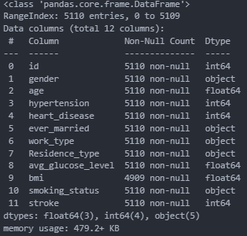

    Secara keseluruhan, mayoritas tipe data pada dataset adalah numerik

    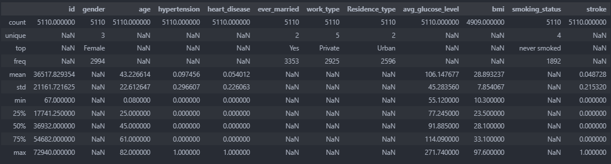

    Penjelasan:
    - id
    Nilai Minimum (min): 67
    Nilai Maksimum (max): 72.940
    - gender
    Jumlah Kategori Unik (unique): 3
    Kategori Terbanyak (top): Female
    Frekuensi Kategori Terbanyak (freq): 2994
    - age
    Nilai Minimum: 0,08
    Nilai Maksimum: 82
    - hypertension
    Nilai Minimum: 0
    Nilai Maksimum: 1
    - heart_disease
    Nilai Minimum: 0
    Nilai Maksimum: 1
    - ever_married
    Jumlah Kategori Unik: 2
    Kategori Terbanyak: Yes
    Frekuensi Kategori Terbanyak: 3353
    - work_type
    Jumlah Kategori Unik: 5
    Kategori Terbanyak: Private
    Frekuensi Kategori Terbanyak: 2925
    - Residence_type
    Jumlah Kategori Unik: 2
    Kategori Terbanyak: Urban
    Frekuensi Kategori Terbanyak: 2596
    - avg_glucose_level
    Nilai Minimum: 55,12
    Nilai Maksimum: 271,74
    - bmi
    Jumlah Data: 4909 (ada missing value karena tidak semua catatan terisi)
    Indeks massa tubuh (BMI) menunjukkan variasi fisik dan kesehatan, dengan sebagian data yang belum lengkap.
    - smoking_status
    Jumlah Kategori Unik: 4
    Kategori Terbanyak: never smoked
    Frekuensi Kategori Terbanyak: 1892

- Cek Data Duplikat

    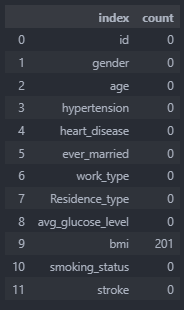

    Hasil pengecekan data missiong menunjukkan bahwa hanya kolom bmi yang memiliki data missing, dengan data missing sebanyak 201 data. Sehingga perlu dilakukan penghapusan data missing pada tahap data preparation.

- Cek Data Duplikat

    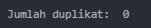

    Hasil pengecekan data duplikat tidak ditemukan data yang duplikat.

- Distribusi Dataset
    - Fitur Numerik

        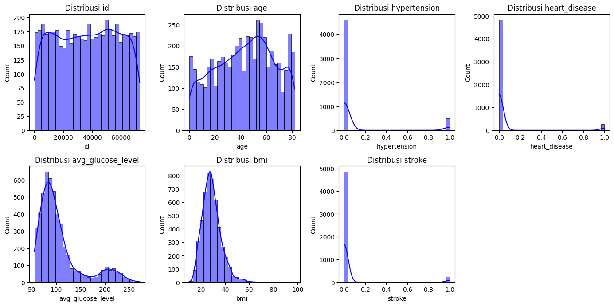

        Penjelasan:
        - Distribusi id: Histogram ini menampilkan distribusi ID individu dalam dataset, dengan nilai berkisar antara 0 hingga sekitar 70,000. Sebagian besar ID memiliki jumlah yang cukup konsisten, berkisar antara 125 hingga 200.
        - Distribusi age (Usia): Distribusi usia menunjukkan rentang dari 0 hingga 80 tahun. Jumlah individu meningkat seiring bertambahnya usia dan mencapai puncak sekitar usia 60 tahun, kemudian menurun setelahnya.
        - Distribusi hypertension (Hipertensi): Distribusi status hipertensi menunjukkan nilai 0 dan 1, di mana nilai 0 jauh lebih dominan. Artinya, mayoritas individu tidak menderita hipertensi.
        - Distribusi heart_disease (Penyakit Jantung): Mirip dengan hipertensi, status penyakit jantung memiliki nilai 0 dan 1, dengan nilai 0 yang jauh lebih tinggi. Hal ini menunjukkan mayoritas individu dalam dataset tidak memiliki penyakit jantung.
        - Distribusi avg_glucose_level (Rata-rata Glukosa): Histogram ini menunjukkan rata-rata kadar glukosa darah individu dengan rentang 50 hingga 250. Sebagian besar individu memiliki kadar glukosa yang berkisar di sekitar 100.
        - Distribusi bmi (Indeks Massa Tubuh): BMI memiliki distribusi dari 10 hingga 100, dengan puncak di sekitar nilai 25, sebelum menurun secara bertahap.
        - Distribusi stroke (Riwayat Stroke): Status stroke menunjukkan nilai 0 dan 1. Mayoritas individu memiliki nilai 0, yang berarti mereka tidak beresiko mengalami stroke.

    - Fitur Kategori

        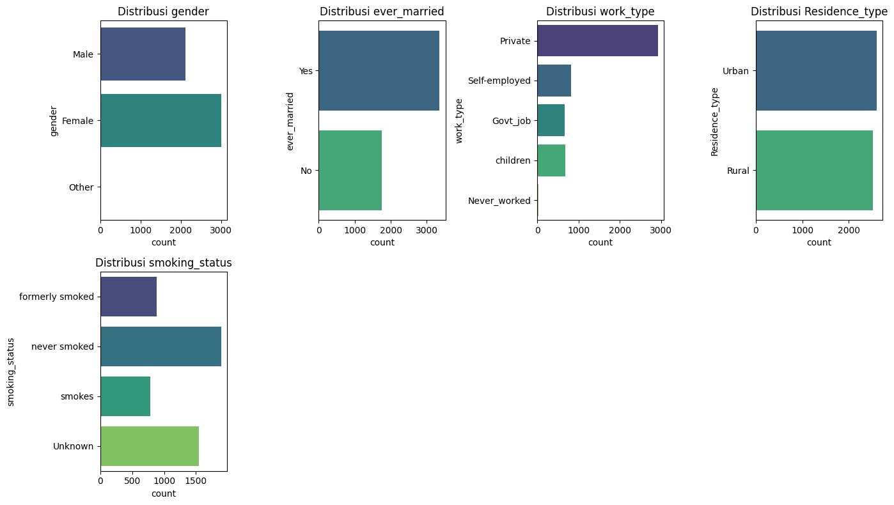

        Penjelasan:
        - Distribusi Gender: Female memiliki jumlah yang paling dominan, diikuti oleh Male. Kategori Other tidak memiliki jumlah sama sekali, sehingga akan dilakukan penghapusan di tahap data preparation. 
        - Distribusi Ever Married: Individu dengan status Yes (sudah menikah) lebih banyak dibandingkan dengan yang belum menikah (No).
        - Distribusi Work Type: Private memiliki jumlah tertinggi, diikuti oleh Self-employed dan Govt_job. Sementara kategori children dan Never_worked memiliki jumlah yang lebih kecil.
        - Distribusi Residence Type: Individu dengan tipe tempat tinggal Urban sedikit lebih banyak dibandingkan dengan Rural.
        - Distribusi Smoking Status: Kategori never smoked memiliki jumlah paling banyak, diikuti oleh Unknown, smokes, dan formerly smoked. 

- Matrik Korelasi

    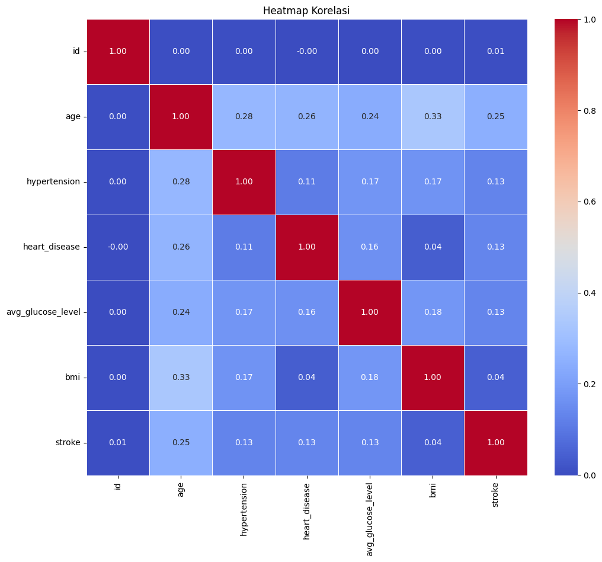

    Matrik korelasi menunjukkan bahwa terdapat korelasi yang tidak terlalu signifikan dengan parameter stroke. Hanya parameter age yang memilki nilai korelasi yang paling tinggi terhadap parameter stroke.

- Distribusi Label

    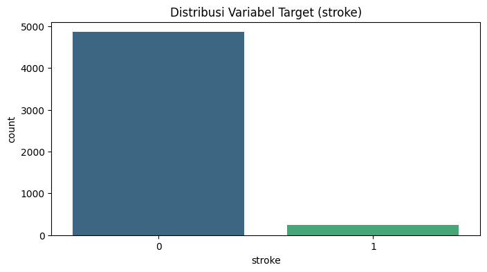

    Distribusi label di atas menunjukkan bahwa terdapat data yang tidak seimbang antara pasien beresiko stroke dan tidak. Mayoritas pasien adalah tidak beresiko stroke. Untuk mengatasi hal tersebut, akan dilakukan teknik SMOTE pada data preparation. 

## Data Preparation
- **Hapus Data Missing** :
    Data yang hilang (missing values) dapat mengganggu algoritma machine learning, menyebabkan bias, atau menghasilkan model yang kurang akurat. Data kosong menyebabkan model sulit mengenali pola saat proses training. Berikut hasil proses hapus data missing, terlihat jumlah data berkurang menjadi 4909 data:

    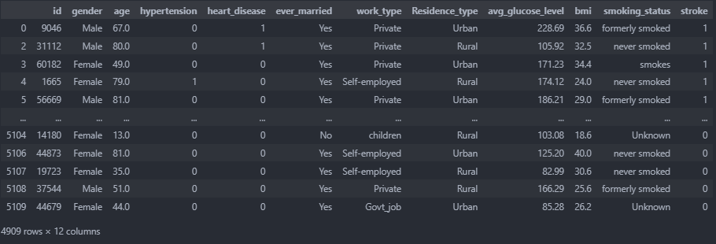

- **One Hot Encoding** :
    Banyak algoritma machine learning memerlukan input numerik. Variabel kategorikal harus diubah ke dalam format numerik agar dapat diproses dengan benar. One Hot Encoding mengonversi tiap kategori ke dalam kolom biner (0 atau 1), sehingga informasi kategorikal dapat diinterpretasikan oleh model. Dari proses one hot encoding, jumlah kolom bertambah menjadi 23 kolom, berikut hasilnya:

    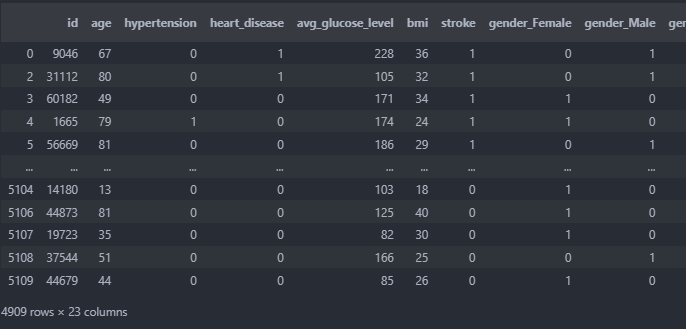

- **Feature Selection** :
    Tidak semua fitur memiliki pengaruh yang signifikan dalam prediksi model. Dengan memilih fitur yang paling relevan, kita dapat mengurangi kompleksitas model, mencegah overfitting, dan meningkatkan performa model. Proses ini juga membantu mempercepat waktu pelatihan dengan menghapus fitur yang tidak informatif. Beberapa fitur yang akan dieliminasi adalah id, Residence_type_Rural, Residence_type_Urban, smoking_status_Unknown, dan gender_Other. Fitur-fitur tersebut akan dihapus karena tidak memiliki relevansi dengan label. Berikut Hasil proses feature selection, jumlah kolom berkurang menjadi 18 kolom:

    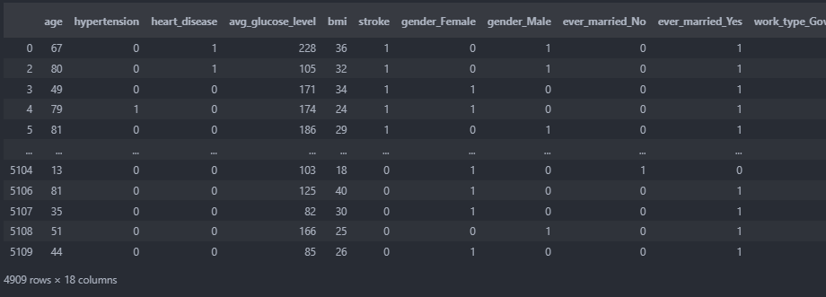

- **Normalisasi Data** :
    Fitur numerik sering berbeda skalanya, yang bisa membuat model lebih condong pada fitur dengan rentang nilai yang besar. Normalisasi menyamakan skala fitur, sehingga algoritma yang sensitif terhadap skala dapat bekerja lebih optimal dan konvergensi model menjadi lebih stabil. Berikut hasil normalisasi data: 

    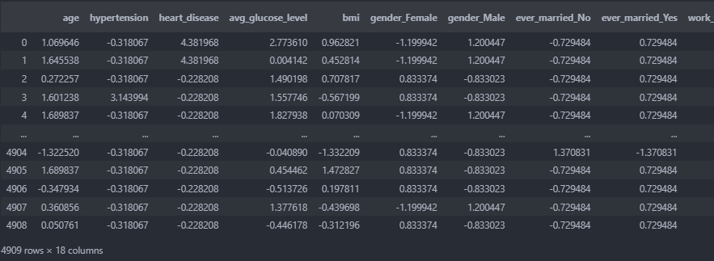

- **SMOTE** :
    Dalam kasus dataset yang tidak seimbang (misalnya jika jumlah kasus stroke jauh lebih sedikit dibandingkan non-stroke), model cenderung bias terhadap kelas mayoritas. SMOTE membantu dengan menyeimbangkan jumlah data di setiap kelas melalui pembuatan sampel sintetis di kelas minoritas, sehingga diperoleh data yang seimbang. Namun, SMOTE sering kali menghasilkan data duplikat. Untuk memastikan bahwa data tidak ada yang duplikat setelah proses SMOTE, maka perlu dilakukan drop data duplikat. Berikut hasil akhir proses SMOTE dan drop data duplikat:
    
    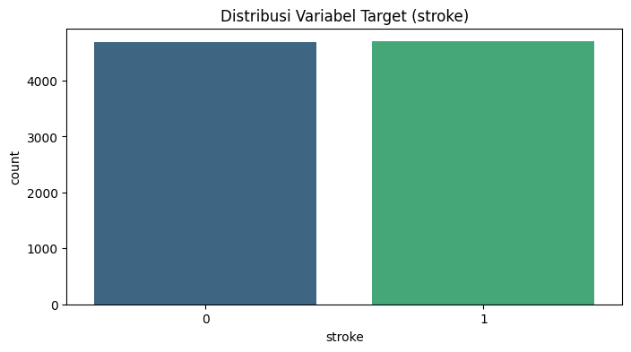

    Diperoleh total data untuk proses modelling sebanyak 9388 data.

## Model Development
- **Spliting Data** : Data yang sudah melalui data preparation selanjutnya akan dibagi menjadi data training dan data testing. Data training untuk melatih model, sedangkan data testing untuk menguji model hasil training. Pembagian data training dan data testing adalah 80% data training dan 20% data testing.
- **Training Model** : Proses training model dilakukan dengan 2 algoritma machine learning, yaitu Randomforest dan KNN. Berikut penjelasan terkait algoritma tersebut:
    - **Randomforest**
        - **Kelebihan** : Algoritma Random Forest merupakan salah satu metode ensemble learning (bagging) yang menggabungkan keputusan dari banyak decision tree melalui mekanisme voting. Pendekatan ini cenderung menghasilkan model yang lebih akurat karena mampu mengurangi variansi dan mengatasi overfitting.
        - **Kekurangan** : Salah satu kekurangan Random Forest adalah waktu pelatihan yang relatif lama, karena setiap decision tree harus dilatih secara terpisah. Secara default, algoritma ini menggunakan 100 decision tree, yang dapat meningkatkan beban komputasi.
    - **K-Nearest Neighbors (KNN)**
        - **Kelebihan** : Algoritma KNN tidak memerlukan proses pelatihan yang kompleks. Metode ini hanya melakukan perhitungan jarak (distance) antara data baru dengan data yang sudah ada. Karena perhitungan jarak pada dataset dengan dimensi rendah relatif cepat, algoritma ini cocok untuk kasus tersebut.
        - **Kekurangan** : KNN kurang optimal untuk dataset dengan dimensi tinggi karena perhitungan jarak antar data menjadi semakin kompleks dan memakan waktu yang cukup lama.

**Pemiliha Model Terbaik**
Dari hasil evaluasi pada notebook, model terbaik adalah Randomforest karena nilai evaluasi metrik seperti (akurasi, precision, recall, dan F1 score) cenderung lebih tinggi dibanding nilai evaluasi metrik dari model KNN. Selain itu, model tidak overfitting, karena range evaluasi metrik pada data testing dan data training tidak terlalu jauh.

## Evaluation
- **Akurasi** merupakan perbandingan antara jumlah data yang diprediksi dengan benar oleh model dan jumlah data keseluruhan. Dalam proyek ini, akurasi didefinisikan sebagai rasio prediksi yang tepat, baik untuk kasus risiko stroke maupun non-risiko stroke terhadap total data yang tersedia. Pada model Randomforest, akurasi data testing mencapai 95% dengan akurasi data training sebesar 99%. Sedangkan pada model KNN, akurasi data testing adalah 91% dan akurasi training mencapai 93%. Secara keseluruhan, kedua model menunjukkan performa yang sangat menjanjikan. Model Randomforest, dengan akurasi yang tinggi dan konsistensi antara data pelatihan dan pengujian, mengindikasikan kestabilan dan minim risiko overfitting. Sementara itu, meskipun model KNN memiliki angka yang sedikit lebih rendah, kinerjanya masih tergolong memuaskan dan memberikan dasar yang kuat untuk dilakukan optimasi lebih lanjut jika diperlukan. Berikut formula dari akurasi:

    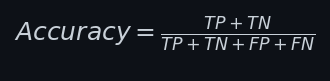 

    Di mana:
    - TP (True Positives): Jumlah kasus resiko stroke yang diprediksi dengan benar.
    - TN (True Negatives): Jumlah kasus non-resiko stroke yang diprediksi dengan benar.
    - FP (False Positives): Kasus non-resiko stroke yang salah diprediksi sebagai resiko stroke.
    - FN (False Negatives): Kasus resiko stroke yang salah diprediksi sebagai non-resiko stroke.
- **Precision** adalah metrik yang digunakan untuk mengukur ketepatan prediksi positif, yaitu seberapa tepat prediksi kasus berisiko stroke dibandingkan dengan seluruh data yang diprediksi berisiko tersebut. Pada model Randomforest, precision mencapai 94% pada data testing dan 99% pada data training, menunjukkan bahwa sebagian besar prediksi positifnya benar. Sedangkan pada model KNN, precision yang diperoleh adalah 86% pada data testing dan 88% pada data training. Secara keseluruhan, model Random Forest dapat dikatakan sangat baik karena nilai precision yang tinggi menunjukkan keandalan dalam mengidentifikasi kasus risiko stroke, serta konsistensi antara data pelatihan dan pengujian. Model KNN, meskipun menghasilkan nilai precision yang lebih rendah, masih tergolong memuaskan untuk aplikasi deteksi awal risiko stroke. Berikut formula dari precision:

    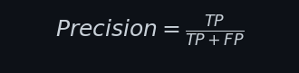

    Di mana:
    - TP (True Positives): Jumlah kasus resiko stroke yang diprediksi dengan benar.
    - FP (False Positives): Kasus non-resiko stroke yang salah diprediksi sebagai resiko stroke.
- **Recall** adalah metrik untuk mengukur kemampuan model dalam menangkap semua kasus positif sebenarnya. Dalam proyek ini, diperoleh nilai recall model Randomforest pada data testing sebesar 97% dan data training sebesar 100%. Sedangkan pada model KNN diperoleh nilai pada data testing sebesar 99%  dan data testing sebesar 99%. Secara keseluruhan, kedua model menunjukkan performa recall yang sangat tinggi. Angka yang mendekati 100% menegaskan bahwa kedua model efektif dalam mendeteksi kasus-kasus positif risiko stroke, yang merupakan aspek krusial dalam konteks pendeteksian risiko stroke. Model KNN bahkan unggul dengan nilai recall lebih tinggi pada data testing, sementara model Randomforest menunjukkan kestabilan dengan performa sempurna pada data training. Berikut formula dari recall:

    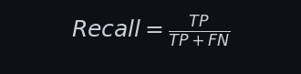

    Di mana:
    - TP (True Positives): Jumlah kasus resiko stroke yang diprediksi dengan benar.
    - FN (False Negatives): Kasus resiko stroke yang salah diprediksi sebagai non-resiko stroke.
- **F1 score** adalah metrik yang mengukur keseimbangan antara precision dan recall, memberikan gambaran menyeluruh mengenai performa model dalam mengidentifikasi kasus positif. Dalam proyek ini, model Random Forest memperoleh nilai F1 score sebesar 96% pada data testing dan 99% pada data training, yang menunjukkan bahwa model ini memiliki performa yang sangat baik serta konsistensi yang tinggi antara data testing dan data training. Sementara itu, model KNN menghasilkan nilai F1 score sebesar 92% pada data testing dan 93% pada data training. Secara keseluruhan, kedua model menunjukkan performa yang menjanjikan dalam hal pengenalan kasus positif risiko stroke. Dengan F1 score yang sangat tinggi pada data testing, model Randomforest menonjol dalam hal generalisasi dan keandalan. Sementara itu, meskipun model KNN memiliki nilai F1 score yang sedikit lebih rendah, hasil yang diperoleh masih berada dalam kategori memuaskan. Hal ini mengindikasikan bahwa kedua model dapat diandalkan, meskipun model Randomforest memiliki keunggulan dalam stabilitas dan performa keseluruhan. Berikut formula dari F1 score:

    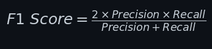

    Di mana:
    - Precision: Nilai Precision.
    - Recall: Nilai Recall.

- **Confusion Matrix**
    - Randomforest

        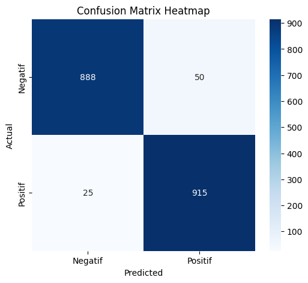

        Penjelasan:
        - TP = Terdapat 915 kasus risiko stroke yang diprediksi benar.
         - TN = Terdapat 915 kasus non-risiko stroke yang diprediksi benar.
         - FP = Terdapat 50 kasus non-risiko stroke yang diprediksi risiko stroke.
         - FN = Terdapat 25 kasus risiko stroke yang diprediksi non-risiko stroke.
    - KNN

        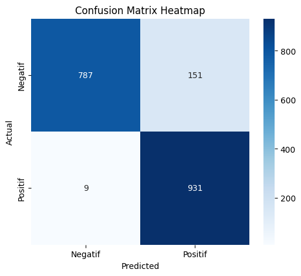

        Penjelasan:
        - TP = Terdapat 931 kasus risiko stroke yang diprediksi benar.
        - TN = Terdapat 787 kasus non-risiko stroke yang diprediksi benar.
        - FP = Terdapat 151 kasus non-risiko stroke yang diprediksi risiko stroke.
        - FN = Terdapat 9 kasus risiko stroke yang diprediksi non-risiko stroke.

    Dari hasil confusion matrix di atas, dapat diketahui model yang memiliki bias yang minim adalah model Randomforest. Kesalahan prediksi pada model Randomforest hanya 75 data, sedangkan pada model KNN mencapai 160 data. Seacara keseluruhan, model sudah memiliki performa cukup bagus, adaikan tidak dilakukan balancing, kasalahan prediksi bisa jauh lebih tinggi dari jumlah sekarang.
